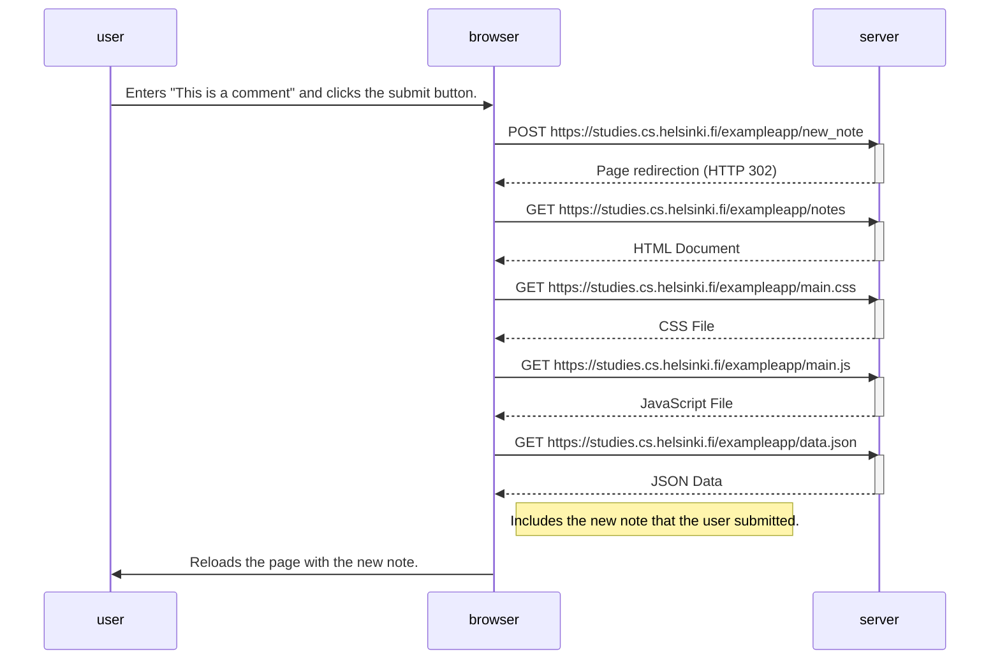

```mermaid
sequenceDiagram
    participant user
    participant browser
    participant server

    user->>browser: Enters "This is a comment" and clicks the submit button.

    browser->>server: POST https://studies.cs.helsinki.fi/exampleapp/new_note
    activate server

    server-->>browser: Page redirection (HTTP 302)
    deactivate server

    browser->>server: GET https://studies.cs.helsinki.fi/exampleapp/notes
    activate server

    server-->>browser: HTML Document
    deactivate server

    browser->>server: GET https://studies.cs.helsinki.fi/exampleapp/main.css
    activate server

    server-->>browser: CSS File
    deactivate server

    browser->>server: GET https://studies.cs.helsinki.fi/exampleapp/main.js
    activate server

    server-->>browser: JavaScript File
    deactivate server

    browser->>server: GET https://studies.cs.helsinki.fi/exampleapp/data.json
    activate server

    server-->>browser: JSON Data
    deactivate server

    Note right of browser: Includes the new note that the user submitted.

    browser->>user: Reloads the page with the new note.
```
