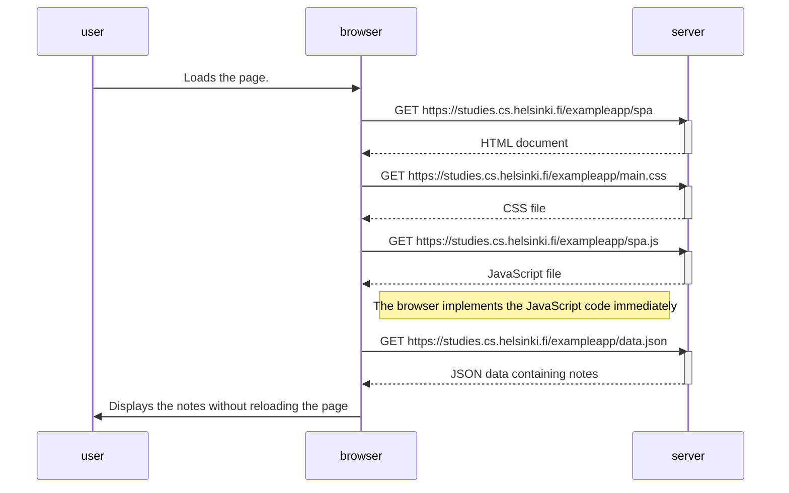

```mermaid
sequenceDiagram
    participant user
    participant browser
    participant server

    user->>browser: Loads the page.

    browser->>server: GET https://studies.cs.helsinki.fi/exampleapp/spa
    activate server

    server-->>browser: HTML document
    deactivate server

    browser->>server: GET https://studies.cs.helsinki.fi/exampleapp/main.css
    activate server

    server-->>browser: CSS file
    deactivate server

    browser->>server: GET https://studies.cs.helsinki.fi/exampleapp/spa.js
    activate server

    server-->>browser: JavaScript file
    deactivate server

    Note right of browser: The browser implements the JavaScript code immediately

    browser->>server: GET https://studies.cs.helsinki.fi/exampleapp/data.json
    activate server

    server-->>browser: JSON data containing notes
    deactivate server

    browser->>user: Displays the notes without reloading the page
```
