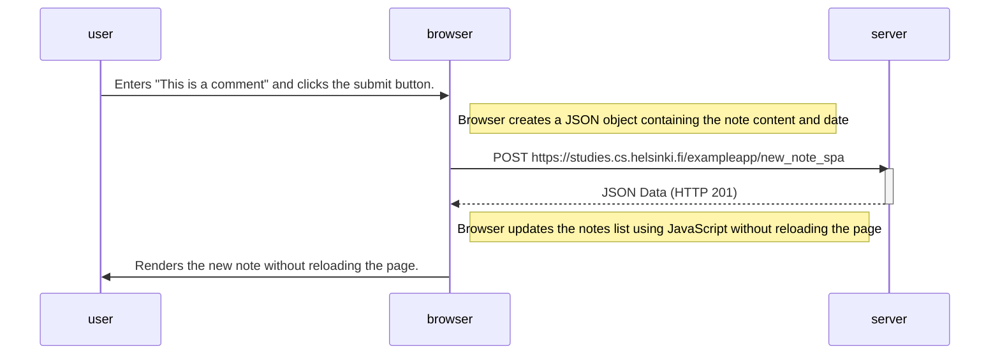

```mermaid
sequenceDiagram
    participant user
    participant browser
    participant server

    user->>browser: Enters "This is a comment" and clicks the submit button.

    Note right of browser: Browser creates a JSON object containing the note content and date

    browser->>server: POST https://studies.cs.helsinki.fi/exampleapp/new_note_spa
    activate server

    server-->>browser: JSON Data (HTTP 201)
    deactivate server

    Note right of browser: Browser updates the notes list using JavaScript without reloading the page

    browser->>user: Renders the new note without reloading the page.
```
